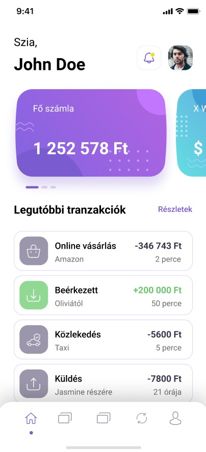
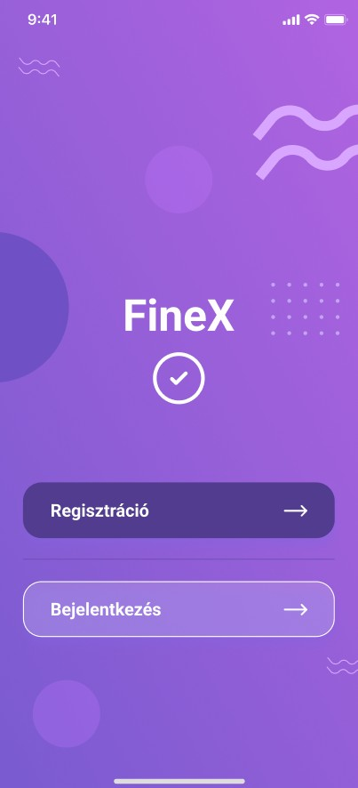

## FineX – Mobilbanki alkalmazás (fejlesztés alatt)

### 🔧 Technológiák
- Java 17+
- Spring Boot 3.5.4
- Spring Web
- Spring Data JPA (Hibernate)
- Lombok
- REST API-k
- Jakarta Validation
- Spring Security (JWT)
- Swagger (Springdoc OpenAPI)
- PostgreSQL
- JUnit 5, Testcontainers (repository tesztek), Spring Boot Test / MockMvc, @WebMvcTest alapú controller slice tesztek   
- Maven  

---

## 📌 Projekt leírás
Saját gyakorló projekt, ahol egy digitális banki backend rendszert építek fel modulárisan Spring Boot segítségével.  
A projekt célja, hogy **valós banki funkciókat** modellezzek és gyakoroljak (felhasználók, bankszámlák, tranzakciók, megtakarítások, átutalások, ügyfélszolgálat).  

---

## ✅ Jelenleg megvalósított funkciók
### Alapok
- Spring Boot alapkonfiguráció
- PostgreSQL adatbázis
- Hibernate + JPA
- Auditing (`createdAt`, `updatedAt`)
- Globális exception handling

### Biztonság
- JWT alapú autentikáció
- Stateless SecurityConfig
- Védett endpointok (csak autentikált felhasználóknak)

### Felhasználók
- Regisztráció
- Bejelentkezés
- Saját profil lekérdezése és módosítása

### Bankszámlák
- Folyószámlák kezelése
- Devizanemek
- Egyenleg kezelés
- Státuszok (ACTIVE, FROZEN, CLOSED)

### Tranzakciók
- Bevétel / kiadás
- Számlák közötti átutalás
- Kimenő és bejövő tranzakciók
- Egyenleg history (BalanceHistory)

### Megtakarítások
- Megtakarítási számlák
- Pénz áthelyezése folyószámla ↔ megtakarítás

### Ügyfélszolgálat
- Support ticket rendszer
- Ticket nyitás csak bejelentkezett felhasználóknak
- Ticket státuszkezelés

---  

## 🧪 Tesztelés

- Unit tesztek
- Repository tesztek **Testcontainers + PostgreSQL** segítségével
- A tesztek **külön, izolált adatbázist** használnak (Docker container)

---

## 🚧 Tervezett funkciók

### Jogosultságkezelés
- User / Admin role-ok
- Admin-only endpointok

### Tranzakciók bővítése
- Szűrés időszak, összeg, típus szerint
- Tranzakció kategóriák
- Statisztikák és dashboard adatok

### Megtakarítások
- Automatikus havi megtakarítás
- Kamat számítás

---

## Tervezett mobilalkalmazás (SwiftUI – WIP)

A Finex backendhez egy **natív iOS mobilbanki alkalmazás** készül SwiftUI technológiával.  
Az alkalmazás célja, hogy a backend funkcióit egy **modern, letisztult mobilbanki felületen** tegye elérhetővé.

⚠️ **Megjegyzés:**  
Az alábbi UI képek és leírások **koncepciótervek**, a végleges funkcionalitás és megjelenés a fejlesztés során változhat.

  
  
  

  

## Tervezett képernyők (SwiftUI)

- **Bejelentkezés / Regisztráció**
  - JWT alapú autentikáció
- **Főoldal / Dashboard**
  - Egyenlegek áttekintése
  - Gyors műveletek
- **Bankszámlák**
  - Folyószámlák listája
  - Egyenleg és devizanem
- **Tranzakciók**
  - Tranzakció lista
  - Szűrés és részletek
- **Megtakarítások**
  - Megtakarítási számlák kezelése
  - Pénz áthelyezés
- **Ügyfélszolgálat**
  - Support ticket létrehozása
  - Ticketek állapotának követése  

