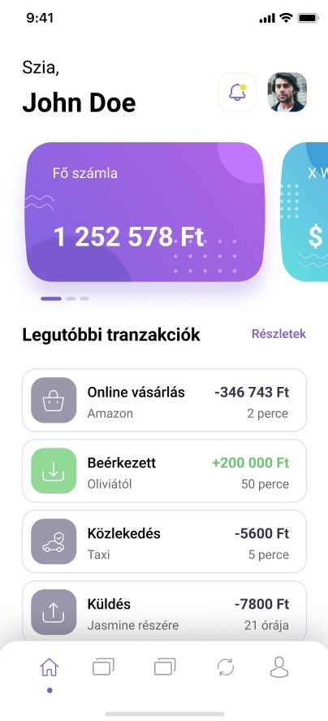
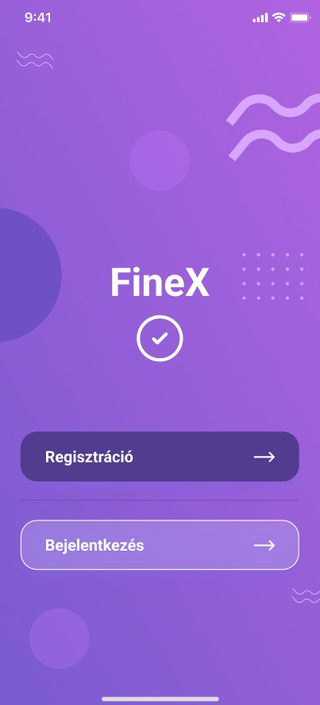

## FineX – digitális bankalkalmazás (fejlesztés alatt)

Spring Boot REST API és React webes felület: felhasználók, bankszámlák, bankkártyák, átutalások, megtakarítások, statisztikák, értesítések és ügyfélszolgálat – biztonságosan, tesztelten, modern felülettel.

### 📁 Projekt felépítése

| Mappa | Tartalom | Fejlesztőeszköz |
|---|---|---|
| [`backend/`](backend) | Spring Boot REST API (Java 17, Maven) | Eclipse / Spring Tool Suite |
| [`frontend/`](frontend) | React + TypeScript webes felület (Vite, Tailwind CSS) | VS Code |
| [`database/`](database) | PostgreSQL (Docker Compose), a séma és a demóadatok leírása | Docker Desktop, pgAdmin |
| [`docs/`](docs) | Dokumentáció, UI koncepcióképek | – |

---

### 🔧 Technológiák

**Backend**
- Java 17, Spring Boot 3.5.8, Maven
- Spring Web, Spring Data JPA (Hibernate), Jakarta Validation, Lombok
- Spring Security, JWT alapú autentikáció
- Swagger UI (Springdoc OpenAPI)
- Ütemezett feladatok (Spring Scheduling)

**Adatbázis**
- PostgreSQL 15 (Docker Compose)
- Flyway – verziózott adatbázis-migrációk (a Hibernate csak ellenőriz: `ddl-auto=validate`)

**Frontend**
- React 19, TypeScript, Vite
- Tailwind CSS 4 – saját design system, világos és sötét mód
- React Router (oldalanként betöltődő kód), TanStack Query (szerveradatok gyorsítótárazása), axios
- React Hook Form + Zod (űrlapok és validáció)
- Motion (animációk), Sonner (értesítő buborékok), Lucide ikonok

**Tesztelés**
- JUnit 5, Mockito, Spring Boot Test / MockMvc, `@WebMvcTest` controller slice tesztek
- Testcontainers + PostgreSQL (repository-, adatbázisszabály- és integrációs tesztek)

---

## 🚀 Indítás (fejlesztői környezet)

Szükséges: Docker Desktop, JDK 17 vagy újabb, Node.js 22.12 vagy újabb.

1. **Adatbázis** – a `database` mappában:
   ```bash
   docker compose up -d
   ```
2. **Backend** – Eclipse-ben a `FinexApplication` futtatásával, vagy a `backend` mappában:
   ```bash
   ./mvnw spring-boot:run
   ```
   (Windows PowerShellben: `.\mvnw.cmd spring-boot:run`.) Az első induláskor a Flyway létrehozza a sémát és betölti a demóadatokat.
   API: http://localhost:8080 · Swagger UI: http://localhost:8080/swagger-ui.html
3. **Frontend** – a `frontend` mappában:
   ```bash
   npm install
   npm run dev
   ```
   Webes felület: http://localhost:5173 (a `/api/...` kéréseket a Vite továbbítja a backendnek).

A demó felhasználók belépési adatai a [`database/README.md`](database/README.md#demó-felhasználók) fájlban vannak.

---

## 📌 Projekt leírás
Saját projekt, ahol egy digitális bank backendjét és webes felületét építem fel modulárisan, Spring Boot és React segítségével.
A projekt célja, hogy **valós banki funkciókat** modellezzek és gyakoroljak (felhasználók, bankszámlák, bankkártyák, tranzakciók, megtakarítások, átutalások, ügyfélszolgálat).

---

## ✅ Megvalósított funkciók (backend)
### Alapok
- Spring Boot alapkonfiguráció
- PostgreSQL adatbázis
- Hibernate + JPA
- Flyway-migrációk: séma, `CHECK` megszorítások, részleges indexek, a könyvelt tételeket védő trigger, SQL-függvények és nézet (részletek: [`database/README.md`](database/README.md))
- Demóadatok (felhasználók, számlák, kártyák, fél év tranzakció, megtakarítások)
- Auditing (`createdAt`, `updatedAt`)
- Globális exception handling
- Ütemezett feladatok (havi kamatjóváírás, rendszeres átutalások)

### Biztonság
- JWT alapú autentikáció
- Stateless SecurityConfig
- Védett endpointok (csak autentikált felhasználóknak)
- User / Admin szerepkörök, admin végpontok
- Minden felhasználó csak a saját adatait látja és módosíthatja
- Belépési napló, 5 sikertelen próbálkozás után átmeneti zárolás

### Felhasználók
- Regisztráció (automatikus folyószámlával és bankkártyával)
- Bejelentkezés
- Saját profil lekérdezése és módosítása, jelszócsere

### Bankszámlák
- Folyószámlák kezelése
- Devizanemek (HUF, EUR, USD)
- Egyenleg kezelés
- Státuszok (ACTIVE, BLOCKED, FROZEN, CLOSED)
- Számlakivonat futó egyenleggel

### Bankkártyák
- Kártya minden számlához
- Tiltás / feloldás, napi limit, online fizetés engedélyezése
- Kártyás fizetés (demó)

### Tranzakciók
- Bevétel / kiadás
- Számlák közötti átutalás (napi limittel, fedezetellenőrzéssel, párhuzamos utalásoknál is konzisztensen)
- Kimenő és bejövő tranzakciók
- Egyenleg history (BalanceHistory)
- Szűrés időszak, összeg, típus, kategória és szöveg szerint
- Tranzakció kategóriák
- Kedvezményezettek, rendszeres átutalások

### Megtakarítások
- Megtakarítási számlák célösszeggel
- Pénz áthelyezése folyószámla ↔ megtakarítás
- Havi kamatjóváírás

### Statisztikák és értesítések
- Főoldal összesítő, havi bevétel/kiadás, költés kategóriánként
- Értesítések (beérkező utalás, biztonsági események, ügyfélszolgálati válasz)

### Ügyfélszolgálat
- Support ticket rendszer
- Ticket nyitás csak bejelentkezett felhasználóknak
- Ticket státuszkezelés
- Üzenetváltás a ticketen belül (admin válasz)

---

## 🖥️ Webes felület (React)

A frontend öt részben készül. A még el nem készült oldalak helyén egy „Hamarosan” oldal mutatja, mi fog ott szerepelni.

- [x] **1. Alapok** – design system (lila márkaszín, világos / sötét / rendszer téma), animált belépés és regisztráció, alkalmazáskeret (oldalsáv, felső sáv, mobilos alsó menü), munkamenet-kezelés (JWT, lejáratkor automatikus kiléptetés), szerepkör alapú útvonalvédelem
- [ ] **2. Főoldal, számlák, bankkártyák**
- [ ] **3. Pénzmozgás** – tranzakciók, utalás lépésről lépésre, kedvezményezettek, rendszeres átutalások
- [ ] **4. Tervezés** – megtakarítások, statisztikák
- [ ] **5. Fiók és adminisztráció** – értesítések, profil és biztonság, ügyfélszolgálat, admin felület

A kód felépítése (`frontend/src`):

| Mappa | Tartalom |
|---|---|
| `app/` | Útvonalak, az alkalmazás kerete (oldalsáv, fejléc, alsó menü), menüszerkezet |
| `features/` | Oldalak funkciónként (belépés, főoldal, hibaoldalak, …) |
| `components/` | Újrahasznosítható UI-elemek (`ui/`) és márkaelemek (`brand/`) |
| `api/` | Backend-hívások és a DTO-k TypeScript típusai |
| `session/` | Munkamenet (token, lejárat) és útvonalvédők |
| `theme/` | Világos / sötét mód |
| `lib/`, `hooks/` | Segédfüggvények, közös animációk |

---

## 🧪 Tesztelés

- 429 automatizált backend teszt – futtatás a `backend` mappában: `./mvnw test` (a Testcontainers miatt a Dockernek futnia kell)
- Unit tesztek (mapperek, service-ek Mockitóval)
- Controller slice tesztek (@WebMvcTest)
- Repository és adatbázis-szabály tesztek **Testcontainers + PostgreSQL** segítségével
- Párhuzamos utalások integrációs tesztje (a számla nem mehet mínuszba)
- A tesztek **külön, izolált adatbázist** használnak (Docker container)
- Frontend: TypeScript típusellenőrzés és ESLint (`npm run build`, `npm run lint`)

---

## 🚧 Tervezett funkciók

### Webes felület
- A frontend 2–5. része (lásd fent)

### Megtakarítások
- Automatikus havi megtakarítás

---

## Tervezett mobilalkalmazás (SwiftUI – WIP)

A Finex backendhez egy **natív iOS mobilbanki alkalmazás** készül SwiftUI technológiával.  
Az alkalmazás célja, hogy a backend funkcióit egy **modern, letisztult mobilbanki felületen** tegye elérhetővé.

⚠️ **Megjegyzés:**  
Az alábbi UI képek és leírások **koncepciótervek**, a végleges funkcionalitás és megjelenés a fejlesztés során változhat.

<div align="center">
  
  
  
</div>  

## Tervezett képernyők (SwiftUI)

- **Bejelentkezés / Regisztráció**
  - JWT alapú autentikáció
- **Főoldal / Dashboard**
  - Egyenlegek áttekintése
  - Gyors műveletek
- **Bankszámlák**
  - Folyószámlák listája
  - Egyenleg és devizanem
- **Tranzakciók**
  - Tranzakció lista
  - Szűrés és részletek
- **Megtakarítások**
  - Megtakarítási számlák kezelése
  - Pénz áthelyezés
- **Ügyfélszolgálat**
  - Support ticket létrehozása
  - Ticketek állapotának követése  
